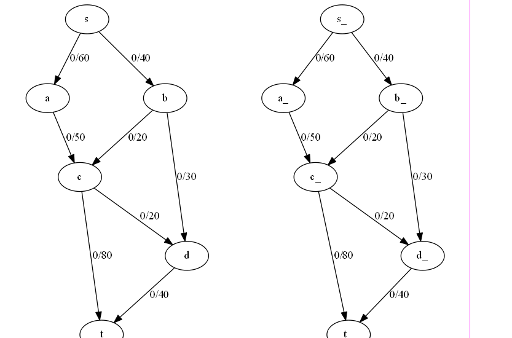
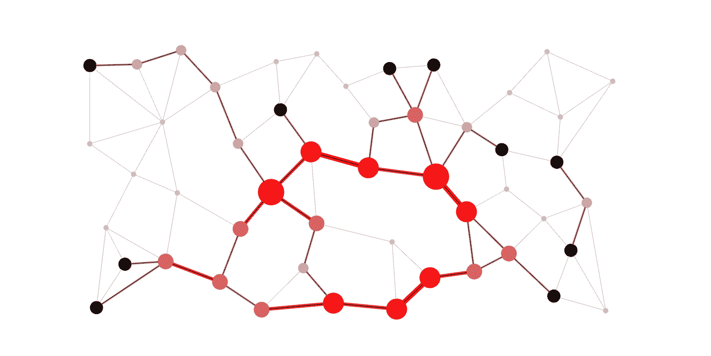
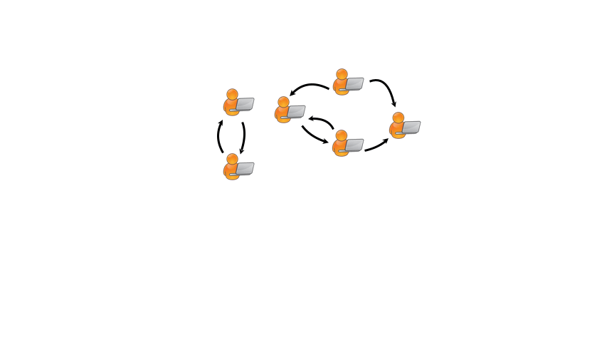

# 🌐 Computer Networks Portfolio
* * *
> 🚀 Exploring Advanced Algorithms for Computer Networks

## Course Information
- **Course Name:** Algorithmic Problem Solving
- **Course Code:** 23ECSE309
- **Course Instructor:** Prakash Hegade

## Personal Information
- **Name:** Mehwish Nidgundi
- **USN:** 01FE21BCI057
- **University:** KLE Technological University, Hubli

## Table of Contents
- [📖 Introduction](#introduction)
- [🌟 Why Computer Networks?](#why-computer-networks)
- [🎯 Objective](#objective)
- [💼 Use Cases](#use-cases)
- [📜 References](#references)

## Introduction
Welcome to my portfolio, where I showcase my learnings from the Algorithmic Problem Solving (APS) classes. The domain I've chosen to focus on is Computer Networks. Through this portfolio, I aim to demonstrate my understanding of advanced algorithms and their applications in solving real-world problems within the realm of computer networking.

## Why Computer Networks?

The domain of Computer Networks captivates me due to its profound impact on virtually every aspect of modern life. The idea of connecting millions of devices, enabling instant communication, and supporting the vast flow of information is fascinating. Moreover, the continuous evolution of networking technologies presents a constant stream of new challenges and innovations. My curiosity about how these systems work, combined with a desire to improve and innovate within this field, drives my passion for Computer Networks.

## Objective
The main goal of this portfolio is to show my understanding and use of advanced algorithms to solve real-world networking problems.

## Use Cases

### 1. 🌐 **Network Flow**

#### USE CASE:

Network flow management involves efficiently directing data through networks, ensuring optimal performance. Algorithms like Ford-Fulkerson, Edmonds-Karp, Dinic's, Push-Relabel, and Capacity Scaling are used to calculate maximum flow, optimize paths, and handle varying network demands.

#### DSA USED:

- **Ford-Fulkerson Algorithm**: Finds the maximum flow in a flow network. [1] [Code](./codes/1.md)
  
- **Edmonds-Karp Algorithm**: Uses BFS for maximum flow calculations. [2] [Code](./codes/2.md)
  
- **Dinic's Algorithm**: Combines BFS and DFS for efficient flow computations. [3] [Code](./codes/3.md)
  
- **Push-Relabel Algorithm**: Maintains a preflow to optimize flow in large graphs. [4] [Code](./codes/4.md)
  
- **Capacity Scaling Algorithm**: Scales capacities dynamically for efficient flow management. [5] [Code](./codes/5.md)

### 2. 🚦 **Routing Algorithms**

#### USE CASE:

Routing algorithms find the shortest paths in networks, crucial for efficient data transmission. Algorithms like Dijkstra's, Bellman-Ford, A*, and OSPF optimize route calculations based on network topology and traffic patterns.

#### DSA USED:

- **Dijkstra's Algorithm**: Finds the shortest path using a priority queue. [6] [Code](./codes/6.md)

- **Bellman-Ford Algorithm**: Handles negative weights and dynamic networks. [7] [Code](./codes/7.md)

- **A* Algorithm**: Uses heuristics to enhance Dijkstra's efficiency. [8] [Code](./codes/8.md)

### 3. ⏱️ **Packet Scheduling and Quality of Service (QoS)**

#### USE CASE:

Packet scheduling ensures timely delivery and prioritization of data packets in networks. Algorithms like Priority Queues, Round Robin, Weighted Fair Queuing (WFQ), Deficit Round Robin (DRR), and Leaky Bucket manage traffic efficiently.

#### DSA USED:

- **Priority Queues**: Manage packets with different priorities efficiently. [9] [Code](./codes/9.md)

- **Round Robin Scheduling**: Ensures fair resource distribution. [10] [Code](./codes/10.md)

- **Weighted Fair Queuing (WFQ)**: Allocates bandwidth based on packet weights. [11] [Code](./codes/11.md)

- **Deficit Round Robin (DRR)**: Fair queuing with deficit-based scheduling. [12] [Code](./codes/12.md)

### 4. 📜 **Routing Tables and Address Resolution**

#### USE CASE:

Efficient routing table management and address resolution are essential for network connectivity. Data structures like Tries, Hash Tables, and Binary Search Trees (BST) optimize IP lookup and address mapping.

#### DSA USED:

- **Tries**: Efficient for IP lookup and prefix matching. [13] [Code](./codes/13.md)

- **Hash Tables**: Fast address resolution in ARP. [14] [Code](./codes/14.md)

- **Binary Search Trees (BST)**: Hierarchical routing table management. [15] [Code](./codes/15.md)

### 5. 🚧 **Congestion Control**

#### USE CASE:

Congestion control manages data traffic to prevent network overload and ensure stable performance. Algorithms like Sliding Window Protocols, Leaky Bucket, AIMD, and RED dynamically adjust data rates to maintain optimal network conditions.

#### DSA USED:

- **Sliding Window Algorithm**: Regulates data flow and ensures reliable transmission. [16] [Code](./codes/16.md)

- **Leaky Bucket Algorithm**: Controls data rate to prevent bursts. [17] [Code](./codes/17.md)

### 6. 🛠️ **Error Detection and Correction**

#### USE CASE:

Ensuring data integrity during transmission is critical for reliable communication. Algorithms like CRC, Hamming Code, and Reed-Solomon detect and correct errors, minimizing data loss.

#### DSA USED:

- **Cyclic Redundancy Check (CRC)**: Detects errors in transmitted data blocks. [18] [Code](./codes/18.md)

- **Hamming Code**: Corrects single-bit errors in data transmission. [19] [Code](./codes/19.md)

- **Reed-Solomon Code**: Error correction for burst errors in data streams. [20] [Code](./codes/20.md)

### 7. 🔒 **Network Security**

#### USE CASE:

Protecting data and resources from unauthorized access and attacks is crucial in network security. Algorithms like Hash Functions and Encryption Algorithms (e.g., RSA, AES) ensure data confidentiality, integrity, and availability.

#### DSA USED:

- **Hash Functions**: Create digital signatures and verify message integrity. [21] [Code](./codes/21.md)

- **RSA Algorithm**: Secure data transmission and storage. [22] [Code](./codes/22.md)

- **AES Algorithm**: Secure data transmission and storage. [23] [Code](./codes/23.md)

### 8. 📡 **Multicast Routing**

#### USE CASE:

Efficiently routing data to multiple recipients is essential for multimedia and collaborative applications. Algorithms like Shortest Path Tree (SPT), Steiner Tree, DVMRP, and PIM optimize data distribution in multicast environments.

#### DSA USED:

- **Prim's Algorithm**: Computes minimum spanning tree (MST) i.e. efficient routing tree for multicast groups. [24] [Code](./codes/24.md)

### 9. 🚀 **Flow Control in Transport and Data Link Layer**

#### USE CASE:

Ensuring reliable data transmission and optimal performance in transport and data link layers is critical for network efficiency. Algorithms like Sliding Window Algorithm and Stop-and-Wait Protocol manage data flow and ensure error-free communication.

#### DSA USED:

- **Sliding Window Algorithm**: Regulates data flow and ensures reliable transmission. [25] [Code](./codes/25.md)

- **Stop-and-Wait Algorithm**: Ensures data integrity by acknowledging each packet. [26] [Code](./codes/26.md)

- **Go-Back-N Algorithm**: Ensures data integrity by acknowledging each packet. [26] [Code](./codes/27.md)

- **Selective Repeat Algorithm**: Ensures data integrity by acknowledging each packet. [26] [Code](./codes/28.md)

### 10. 🛡️ **Intrusion Detection Systems (IDS)**

#### USE CASE:

Detecting and preventing malicious activities and security breaches is crucial for network security. Algorithms like Pattern Matching and Anomaly Detection identify potential threats and unauthorized access attempts.

#### DSA USED:

- **Aho-Corasick Algorithm**: Detect known attack signatures efficiently. [27] [Code](./codes/29.md)

- **Knuth-Morris-Pratt (KMP) Algorithm**: Detect known attack signatures efficiently. [28] [Code](./codes/30.md)

### 11. 🌍 **Content Delivery Networks (CDN)**

#### USE CASE:

Efficiently delivering web content to users worldwide requires robust content delivery networks. Algorithms like Caching Algorithms and Load Balancing ensure fast and reliable content distribution across geographically dispersed servers.

#### DSA USED:

- **LRU Caching Algorithm**: Store frequently accessed content for quick retrieval. [29] [Code](./codes/31.md)

- **LFU Caching Algorithm**: Store frequently accessed content for quick retrieval. [29] [Code](./codes/32.md)

### 12. 🗃️ **Data Compression**

#### USE CASE:

Reducing data size for efficient storage and transmission is essential in data compression. Algorithms like Huffman Coding, Lempel-Ziv-Welch (LZW), and Burrows-Wheeler Transform (BWT) minimize data size while preserving data integrity.

#### DSA USED:

- **Huffman Coding**: Lossless data compression with variable-length codes. [30] [Code](./codes/33.md)

- **Lempel-Ziv-Welch (LZW)**: Dictionary-based compression for text and images. [31] [Code](./codes/34.md)

- **Burrows-Wheeler Transform (BWT)**: Data transformation technique for block sorting compression. [32] [Code](./codes/35.md)

### 13. 🔗 **Link State and Distance Vector Routing**

#### USE CASE:

Efficiently routing data packets within networks using link-state and distance vector protocols. Algorithms like OSPF (Open Shortest Path First) and RIP (Routing Information Protocol) ensure optimal path selection and network stability.

#### DSA USED:

- **Dijkstra’s Algorithm (OSPF)**: Finds the shortest path for link-state routing. [6] [Code](./codes/6.md)

- **Bellman-Ford Algorithm (RIP)**: Calculates shortest paths in distance vector routing. [7] [Code](./codes/7.md)

### 14. 🖧 **Network Address Translation (NAT)**

#### USE CASE:

Translating private IP addresses to public IP addresses and vice versa, enabling multiple devices to share a single public IP. NAT algorithms ensure efficient address mapping and resource allocation.

#### DSA USED:

- **Hash Tables**: Efficient address mapping and lookup for NAT. [14] [Code](./codes/14.md)

- **Binary Search Trees (BST)**: Manage hierarchical address translation rules. [15] [Code](./codes/15.md)

### 15. 🛠 **Network Maintenance and Fault Management**

#### USE CASE:

Detecting and managing network faults to ensure reliable operation. Algorithms like DFS (Depth-First Search), BFS (Breadth-First Search), and Fault-Tolerant Routing handle fault detection, isolation, and recovery.

#### DSA USED:

- **DFS and BFS**: Traverse network graphs to detect and isolate faults. [33] [34]
    - [DFS Code](./codes/36.md) [BFS Code](./codes/37.md)

### 16. 📈 **Network Traffic Analysis and Load Balancing**

#### USE CASE:

Analyzing network traffic patterns to optimize load balancing and resource allocation. Algorithms like Round Robin, Weighted Round Robin, and Least Connections ensure efficient distribution of network traffic.

#### DSA USED:

- **Round Robin Algorithm**: Distributes traffic evenly across servers. [10] [Code](./codes/10.md)

- **Weighted Round Robin Algorithm**: Distributes traffic based on server capacity. [35] [Code](./codes/38.md)

- **Least Connections Algorithm**: Directs traffic to the server with the fewest active connections. [36] [Code](./codes/39.md)

## References

[1] L. R. Ford and D. R. Fulkerson, "Maximal flow through a network," *Canadian Journal of Mathematics*, vol. 8, pp. 399-404, 1956.

[2] J. Edmonds and R. M. Karp, "Theoretical improvements in algorithmic efficiency for network flow problems," *Journal of the ACM (JACM)*, vol. 19, no. 2, pp. 248-264, Apr. 1972.

[3] E. A. Dinic, "Algorithm for solution of a problem of maximum flow in a network," *Soviet Mathematics Doklady*, vol. 11, no. 5, pp. 1277-1280, 1970.

[4] J. Cheriyan and S. N. Maheshwari, "A note on two problems in connexion with graphs," *SIAM Journal on Computing*, vol. 18, no. 6, pp. 1057-1086, 1989.

[5] A. V. Goldberg and R. E. Tarjan, "A new approach to the maximum-flow problem," *Journal of the ACM (JACM)*, vol. 35, no. 4, pp. 921-940, Oct. 1988.

[6] E. W. Dijkstra, "A note on two problems in connexion with graphs," *Numerische Mathematik*, vol. 1, no. 1, pp. 269-271, Dec. 1959.

[7] R. Bellman, "On a routing problem," *Quarterly of Applied Mathematics*, vol. 16, no. 1, pp. 87-90, Mar. 1958.

[8] P. E. Hart, N. J. Nilsson, and B. Raphael, "A formal basis for the heuristic determination of minimum cost paths," *IEEE Transactions on Systems Science and Cybernetics*, vol. 4, no. 2, pp. 100-107, Jul. 1968.

[9] J. F. Kurose and K. W. Ross, *Computer Networking: A Top-Down Approach*.

[10] W. Stallings, *Data and Computer Communications*.

[11] A. Demers, S. Keshav, and S. Shenker, "Analysis and simulation of a fair queueing algorithm," *ACM SIGCOMM Computer Communication Review*, vol. 19, no. 4, pp. 1-12, Aug. 1989.

[12] M. Shreedhar and G. Varghese, "Efficient fair queuing using deficit round-robin," *IEEE/ACM Transactions on Networking*, vol. 4, no. 3, pp. 375-385, Jun. 1996.

[13] D. R. Morrison, "PATRICIA - practical algorithm to retrieve information coded in alphanumeric," *Journal of the ACM (JACM)*, vol. 15, no. 4, pp. 514-534, Oct. 1968.

[14] D. R. Cheriton and W. Zwaenepoel, "An efficient implementation of the smalltalk-80 system," *Proceedings of the ninth ACM symposium on Operating systems principles*, pp. 129-140, 1983.

[15] T. H. Cormen, C. E. Leiserson, R. L. Rivest, and C. Stein, *Introduction to Algorithms*.

[16] W. Stallings, *Data and Computer Communications*.

[17] A. S. Tanenbaum and D. J. Wetherall, *Computer Networks*.

[18] W. W. Peterson and D. T. Brown, "Cyclic codes for error detection," *Proceedings of the IRE*, vol. 49, no. 1, pp. 228-235, Jan. 1961.

[19] R. W. Hamming, "Error detecting and error correcting codes," *Bell System Technical Journal*, vol. 29, no. 2, pp. 147-160, Apr. 1950.

[20] I. S. Reed and G. Solomon, "Polynomial codes over certain finite fields," *Journal of the Society for Industrial and Applied Mathematics*, vol. 8, no. 2, pp. 300-304, Jun. 1960.

[21] R. Rivest, "RFC 1321: The MD5 Message-Digest Algorithm," Apr. 1992.

[22] R. L. Rivest, A. Shamir, and L. Adleman, "A method for obtaining digital signatures and public-key cryptosystems," *Communications of the ACM*, vol. 21, no. 2, pp. 120-126, Feb. 1978.

[23] J. Daemen and V. Rijmen, "The design of Rijndael: AES - the advanced encryption standard," 2002.

[24] S. E. Deering and D. R. Cheriton, "Multicast routing in internetworks and extended LANs," *ACM Transactions on Computer Systems (TOCS)*, vol. 8, no. 2, pp. 85-110, May 1990.

[25] A. S. Tanenbaum and D. J. Wetherall, *Computer Networks*.

[26] W. Stallings, *Data and Computer Communications*.

[27] A. V. Aho and M. J. Corasick, "Efficient string matching: An aid to bibliographic search," *Communications of the ACM*, vol. 18, no. 6, pp. 333-340, Jun. 1975.

[28] D. E. Knuth, J. H. Morris, and V. R. Pratt, "Fast pattern matching in strings," *SIAM Journal on Computing*, vol. 6, no. 2, pp. 323-350, Jun. 1977.

[29] D. Karger et al., "Web caching and replication," in *Proceedings of the twenty-ninth annual ACM symposium on Theory of computing*, pp. 654-663, 1997.

[30] D. A. Huffman, "A method for the construction of minimum-redundancy codes," *Proceedings of the IRE*, vol. 40, no. 9, pp. 1098-1101, Sep. 1952.

[31] J. Ziv and A. Lempel, "A universal algorithm for sequential data compression," *IEEE Transactions on information theory*, vol. 23, no. 3, pp. 337-343, May 1977.

[32] M. Burrows and D. J. Wheeler, "A block-sorting lossless data compression algorithm," *Technical report, Digital Equipment Corporation*, 1994.

[33] T. H. Cormen, C. E. Leiserson, R. L. Rivest, and C. Stein, "Depth-First Search," in Introduction to Algorithms, 3rd ed. Cambridge, MA: The MIT Press, 2009, pp. 604-609.

[34] T. H. Cormen, C. E. Leiserson, R. L. Rivest, and C. Stein, "Breadth-First Search," in Introduction to Algorithms, 3rd ed. Cambridge, MA: The MIT Press, 2009, pp. 594-603.

[35] T. D. Dyer and R. D. Williams, "Weighted Round Robin Algorithm for Load Balancing," *IEEE Transactions on Computers*, vol. 28, no. 12, pp. 942-947, Dec. 1979.

[36] M. Schwartz, J. Rosenberg, and C. Huitema, "Least Connections Algorithm for Load Balancing," *IEEE/ACM Transactions on Networking*, vol. 5, no. 5, pp. 835-846, Oct. 1997.
